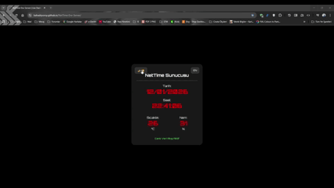

# 🕒 NetTime-Env-Server V2.0.0 🌐
 ### "The NetTime OS - Premium TFT Edition"

  

**NetTime-Env-Server** is a centralized environmental hub designed to provide synchronized time and climate data. It is the official successor to my previous [Date-Time-Tempreture](https://github.com/BahadrPoroy/Date-Time-Tempreture) project.

While the original project was a standalone clock, this version transforms the device into a **Cloud-Connected Data Master**, capable of serving multiple clients and a real-time web interface simultaneously via Firebase.

## 🚀 What's New in v2.0.0

- **NetTime OS UI:** Interactive GUI featuring a Taskbar, Start Menu, and System Tray.
- **2.8" TFT Display:** Vibrant 320x240 color dashboard replacing the legacy OLED.
- **Touch Interaction:** Navigate menus and trigger system commands (e.g., Reboot) via touch.
- **Modular Architecture:** Clean code structure using dedicated Manager classes.
- **Visual OTA:** Live progress bar on the screen during wireless updates.

## 📂 Project Structure

The project has been refactored from a single-file script into a modular, header-based library system to improve scalability and maintainability.

* **DisplayManager.h**: Manages the "NetTime OS" graphical interface, utilizing `TFT_eSPI`. It handles the Windows-style Taskbar, Start Menu logic, and UI animations.
* **NetworkManager.h**: Handles all wireless communications including WiFi station mode, Firebase integration, UDP Broadcasts, and ArduinoOTA update callbacks.
* **TimeManager.h**: Manages NTP server synchronization and provides high-precision time formatting (`HH:MM:SS`) and date strings.
* **TouchManager.h**: Processes touch panel inputs and maps them to screen coordinates using hardware-specific calibration data.
* **config.h**: The Master Configuration file. Contains all pin assignments (HAL) and global system constants.

## 🛠️ Hardware Requirements

- **MCU:** ESP8266 (NodeMCU or Wemos D1 Mini)
- **Sensor:** DHT11 / DHT22 (Temp & Humidity)
- **Display:** 2.8" ILI9341 TFT display (SPI)

## 📡 Technology Stack
- **Firmware:** Arduino IDE (C++), ArduinoJson, NTPClient.
- **Backend:** Firebase Realtime Database.
- **Frontend:** HTML5, CSS3 (Custom Variables), Vanilla JavaScript.
- **Tracking:** Google Analytics GA4.

## 🌐 Setup & Installation
- **1:** Ensure your hardware matches the wiring in `config.h`.
- **2:** Create a `secrets.h` file with your WiFi, Firebase, and OTA credentials.
- **3:** Use the **Arduino IDE** or **PlatformIO** with the `TFT_eSPI` library installed.
- **4:** Set your display driver to **ILI9341** in the library's user setup.
