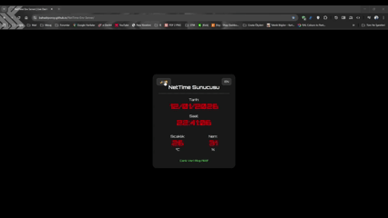

# 🕒 NetTime-Env-Server v2.8.5-pre-alpha 🌐


[](https://opensource.org/licenses/MIT)
## "The NetTime OS - Premium TFT Edition"

## ⚠️ Note: This version is currently in PRE-ALPHA. 

<!-- - **Known Issues: Minor UI rendering artifacts (pixel padding or icon ghosting) may occur during rapid screen transitions or specific weather conditions.** -->

### Bug Reporting: If you encounter any functional or visual bugs, please report them via [GitHub Issues](https://github.com/BahadrPoroy/NetTime-Env-Server/issues). Your feedback helps make **NetTime OS** more stable!

## 📸 Media

<p align="center">
  
</p>
<p align="center">
  <video src="Assets/Project_Showcase.mp4" width="400" autoplay muted loop>
  </video>
</p>

**NetTime-Env-Server** is a centralized environmental hub designed to provide synchronized time and climate data. It is the official successor to my previous [Date-Time-Temperature](https://github.com/BahadrPoroy/Date-Time-Tempreture) project.

While the original project was a standalone clock, this version transforms the device into a **Cloud-Connected Data Master**, capable of serving multiple clients and a real-time web interface simultaneously via Firebase.

## 🚀 What's New in v2.8.5

- **Status:** ⚠️ Unstable for daily use. ⚠️

<!-- ### 🌦 Weather Forecast Integration ###
  - **TFT Forecast UI:** Real-time weather data from OpenWeather API is now displayed on the TFT screen.
  - **Dynamic Icons:** Added support for high-quality BMP weather icons stored on the SD card.  
-->
<!--
### 🐟 Feeder System & Power Recovery
- **Anti-Spam Logic (v2.6.1):** Implemented a 180-second cooldown between feeding commands to prevent redundant triggers caused by network latency.
- **Enhanced Reliability:** Fixed a critical bug in the power loss recovery algorithm.
- **Smart Fail-Safe:** The system now defaults to `isFed = true` during database read failures to prevent accidental overfeeding.
- **Initialization Reordering:** Optimized the `begin` sequence of system modules (`netBox`, `timeBox`, `displayBox`) to ensure network stability before Firebase operations.
- **Stability:** Added `yield()` calls to prevent watchdog resets during intensive network handshakes.
-->

### 📊 Display & UI Improvements
<!-- - **Settings Page has been activated:** Home page is now active with base data showcase, There are 3 segments `tempeture (indoor & outdoor)`,`time`and `feeder status`. It provides seing more information on one page. -->
- **Page icons added for language and display settings under the settings page**
- **The icons are at `/Assets/Page_Icons/` path**
- **Language settings have been activated only visually for now. (`UI would be changed on development`)**
- **`languages` named array is added on `languages.h` file for easy matching the language name from settings**
  - **on `language setting page`, language names come from that array by row index**
- **`SCREEN_WIDTH` and `SCREEN_HEIGHT` constants are added on `config.h` file**
<!-- - **Icon Update:** Home icon is enchanced with a modern one -->
<!-- - **Layout Refactoring:** Added home page button and refactored layout of the desktop page icons. -->

### 📂 Folder & File Structure Improvements
- **Homepage Icons Moved:** In `Assets` folder, a new folder has been created called as `Page_Icons` and all of the desktop icons has been moved in this folder for creating a tidier project structure.

- ### ⚠️ In `drawDesktopPage` function, that in the `displayManager.h` icon paths are updated ###

## 🚧 Roadmap & Work in Progress ## 
  The Settings icon currently serves as placeholders for upcoming modules.
  - ### Future Plan About Settings Page ###
    - **~~Adding a slider for adjusting the screen brightness~~ It's done**
    - **Language option for changing the language on runtime**
    - **Adjusting feeding times on settings**
    - **Theme/color change section**
  - **Status: Navigation to these pages is temporarily restricted while backend integrations are being finalized.**
  - **Note: Features, module names, and UI elements in these sections are subject to change during development.**

## 📂 Project Structure

```
NetTime-Env-Server
├── config.h          # Master Configuration (Pins & Constants)
├── structs.h         # Centralized Data Structures (WeatherData, etc.)
├── DisplayManager.h  # UI Logic, Animations & TFT_eSPI Management
├── NetworkManager.h  # Firebase, WiFi, UDP & OTA Updates
├── TimeManager.h     # NTP Sync & Time Formatting
├── TouchManager.h    # Touch Input Mapping & Calibration
├── myFonts.h         # Centralized Font Management
└── Assets            # Includes fonts, icons and project's showcases
    ├── Page_Icons    # Includes page icons used on desktop and settings pages
    └── Weather_Icons # Includes weather forecast icons got from openWeather
```

## 🛠️ Hardware Requirements

- **MCU:** ESP8266 (NodeMCU or Wemos D1 Mini)
- **Sensor:** DHT11 / DHT22 (Temp & Humidity)
- **Display:** 2.8" ILI9341 TFT display (SPI)
- **Storage:** MicroSD Card (for assets and fonts)

## 🌐 The NetTime Ecosystem
  
  This **Master Server** is designed to work within the NetTime IoT Framework. While it can operate as a standalone node, it reaches its full potential when paired with other ecosystem components:

- NetTime-Env-Server(This Repo): The central hub that provides localized time, environmental data, and acts as the primary network master.

- [NetTime-Client-Display](https://github.com/BahadrPoroy/NetTime-Client-Display): A dedicated monitoring node that visualizes real-time climate data and synchronized time on a peripheral OLED/TFT display.

- [NetTime-Feeder-Client](https://github.com/BahadrPoroy/Feeder-Client): The ecosystem's actuator node, responsible for cloud-triggered hardware automation and persistent state logging.

- [Web Dashboard](https://bahadrporoy.github.io/NetTime-Env-Server/): A real-time interface (integrated within the Server) that allows manual overrides and global monitoring of all connected clients.

## 📡 Technology Stack
- **Firmware:** Arduino IDE (C++), ArduinoJson, NTPClient.
- **Backend:** Firebase Realtime Database, OpenWeather API.
- **Frontend:** HTML5, CSS3 (Custom Variables), Vanilla JavaScript.
- **Tracking:** Google Analytics GA4.

## 🌐 Setup & Installation
- **1:** Ensure your hardware matches the wiring in `config.h`.
- **2:** Create a `secrets.h` file with your WiFi, Firebase, and OTA credentials.
- **3:** Use the **Arduino IDE** or **PlatformIO** with the `TFT_eSPI` library installed.
- **4:** Set your display driver to **ILI9341** in the library's user setup.
- **5:** Upload the `Assets/` folder to your SD card (Ensure the file names match the definitions in DisplayManager.h).
